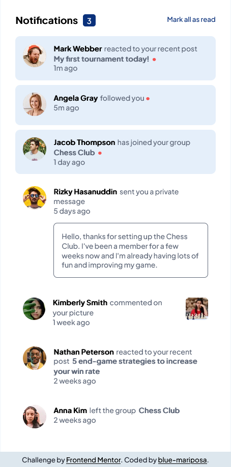
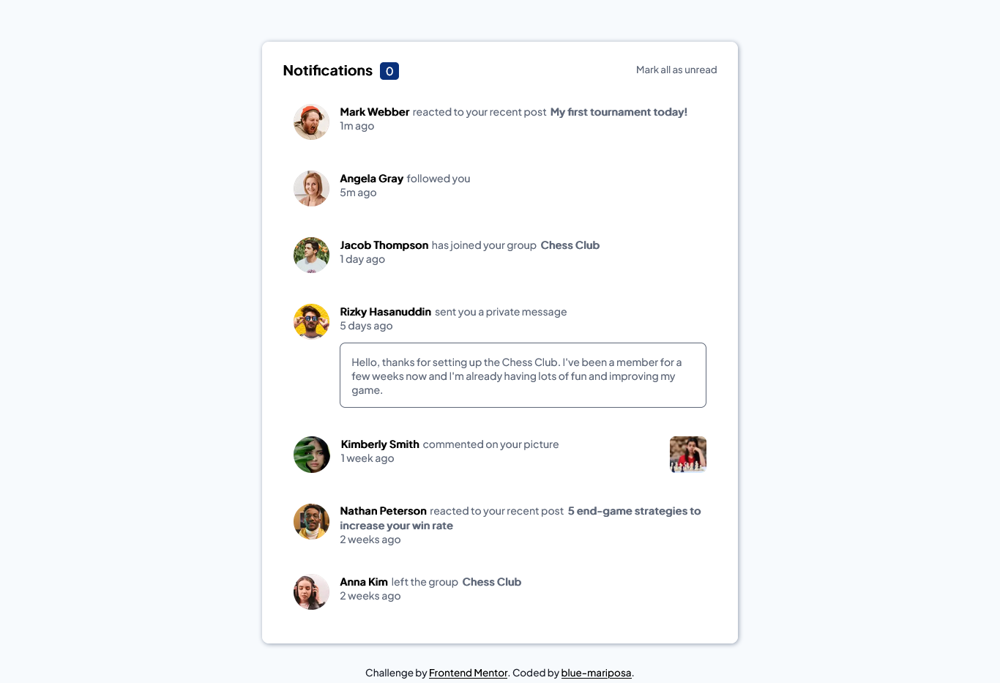
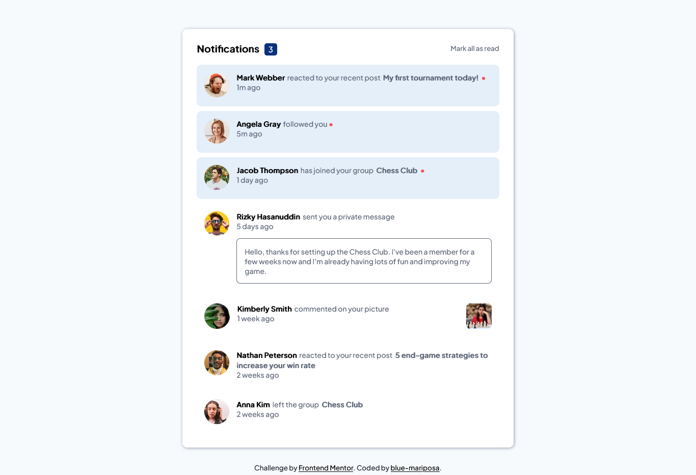
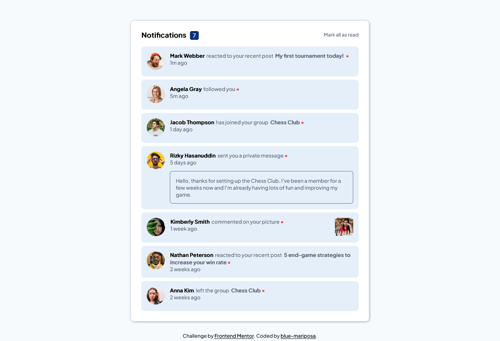

# Frontend Mentor - Product preview card component solution

This is a solution to the [Product preview card component challenge on Frontend Mentor](https://www.frontendmentor.io/challenges/product-preview-card-component-GO7UmttRfa). Frontend Mentor challenges help you improve your coding skills by building realistic projects. 

## Table of contents

- [Overview](#overview)
  - [Screenshot](#screenshot)
- [My process](#my-process)
  - [Built with](#built-with)
  - [What I learned](#what-i-learned)
  - [Continued development](#continued-development)
  - [Useful resources](#useful-resources)
- [Author](#author)
- [Acknowledgments](#acknowledgments)

## Overview

This notification page chllenge was built with accessibility in mind. Did research on suitable tags and attributes that would be accessible to screen readers. Used Html, CSS & JavaScript. 

### Screenshot










## My process
- Took notes of the requirements of the project and research needed.
- Wrote down the structure and classes i may need. [notes.md](./notes.md)
- Created my folder structure.
  - notifications-page
    - assets
      - js[](./assets/js/news-homepage.js)
      - css [](./assets/css/notification-page.css)
      - images [](./assets/images/)
      - screenshots [](./screenshots/)
      - fonts [](./assets/fonts/)
    - index.html [](./index.html)
    - readme.md [](./README.md)
- Created the html.
- Created the css.
  - Imported the fonts from Google fonts.
  - Used flexbox for the header/navigation and the bottom article inner layout.
  - Created the media query for mobile devices.
- Took screenshots.

## Note: I included the fonts offline because i donot have constant access to the internet. However, i have commented out the CSS font-face and included the google font link in the HTML head.     

### Built with

- Semantic HTML5 markup
- CSS custom properties
- Flexbox
- JavaScript
- Mozilla Firefox
- VS-Code

### What I learned

- Creating functions in JavaScript.
- Adding and removing eventListeners.
- Testing / debugging code in browser console before add to main script.

# Code i'm proud of
```html
    <!-- Mark all as read -->
    <p onclick="toggleReadUnread()" id="notice-read-all-btn">Mark all as read</p>
```

```js
function toggleReadUnread() {
    // Check if there are any new notificaions. 
    if (markAllAsRead.textContent == "Mark all as read") {
        // loop through all the new notifications and apply settings below.
        for (let i = 0; i < newNotificationDot.length; i++) {
            // Remove the red dot from notification.
            newNotificationDot[i].textContent = "";
            // Remove background from read notifications.
            eachNotification[i].classList.remove("unread");
        }
        // Reset number of notifications to zero.
        noticeCount.textContent = 0;
        // Change text to "mark-all-as-unread" after reading all notificaions. 
        markAllAsRead.textContent = "Mark all as unread";

    } else /* Check if all notificaions have been read. */ {
        // loop through all the new notifications and apply settings below.
        for (let i = 0; i < newNotificationDot.length; i++) {
            // Add the red dot to notification.
            newNotificationDot[i].innerHTML = "&bull;";
            // Add background to unread notifications.
            eachNotification[i].classList.add("unread");
        }
        // Change number of notifications to unred notifications.
        noticeCount.textContent = newNotificationDot.length;
        // Change text to "mark-all-as-read" after reseting all notificaions to new. 
        markAllAsRead.innerHTML = "Mark all as read";
    }
}
```

### Continued development

- Learn more accessiblity features.
- Create a function to allow clicking on a message to change its state to read.
- Optimize my css code and javascript code.

### Useful resources

- [Javscript references](https://www.javatpoint.com/javascript-setattribute#:~:text=JavaScript%20setAttribute%28%29%20The%20setAttribute%28%29%20method%20is%20used%20to,new%20attribute%20with%20the%20specified%20name%20and%20value.) - change attribute of HTML element.

## Author

- Frontend Mentor - [@blue-mariposa](https://www.frontendmentor.io/profile/blue-mariposa).

## Acknowledgments

- Thanks to Frontend Mentor for the guide(s) [Link](https://www.frontendmentor.io).

- Dr. Angela Yu [The Complete 2022 Web Development Bootcamp](https://www.udemy.com/course/the-complete-web-development-bootcamp/).
